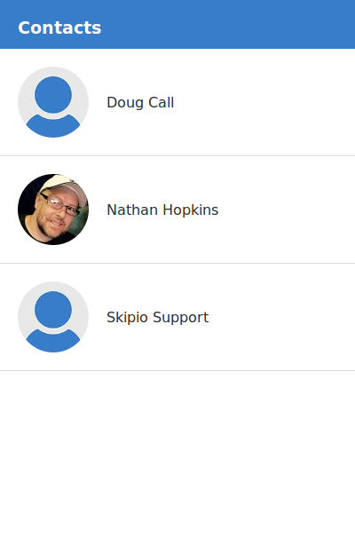

# react-skipio

A simple app showing a list of contacts and allows you to send them an SMS message.



## Setup

Create a `src/credentials.json` file with the following and replace `123abc` with your skipio token.

```json
{
  "token": "123abc",
  "environment": "stage"
}
```

## Running

```
npm start
```

## Todo

- [ ] Add pagination to `ContactList`
- [ ] Add ability to customize message
- [ ] Show the name of the person you are messages in the title of the header
- [ ] Show past messages
- [ ] Add a back arrow on the header when sending a text

## Bootstrapped with Create React App

This project was bootstrapped with [Create React App](https://github.com/facebookincubator/create-react-app).
